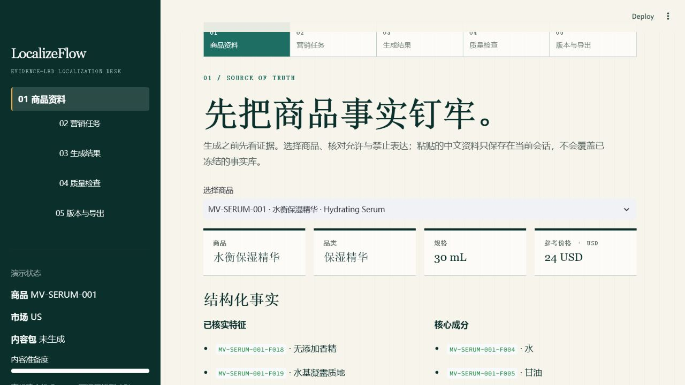
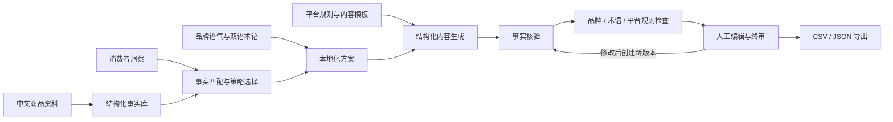
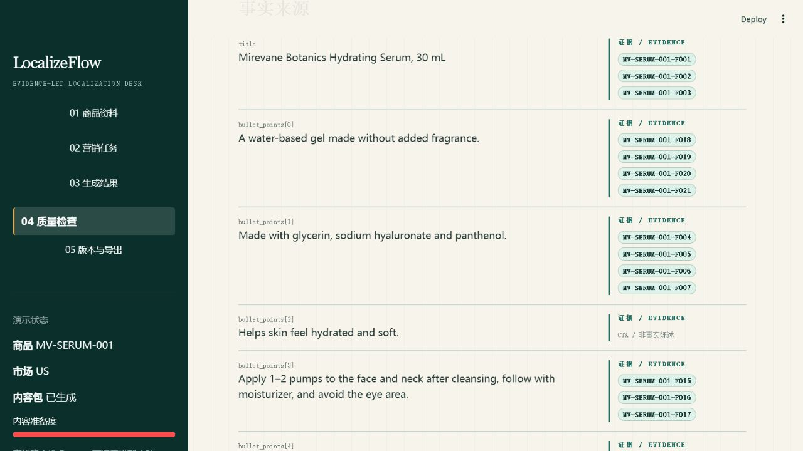
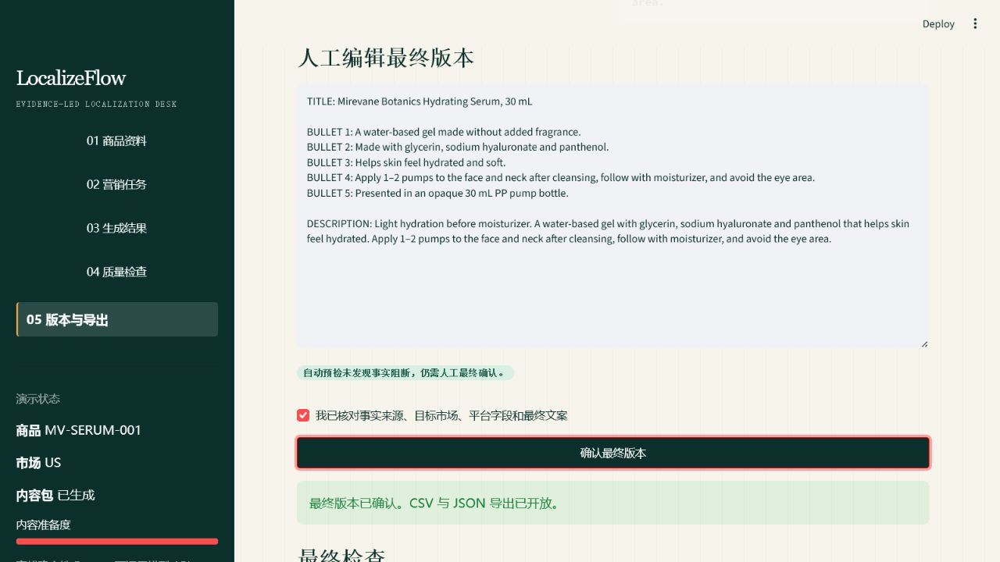
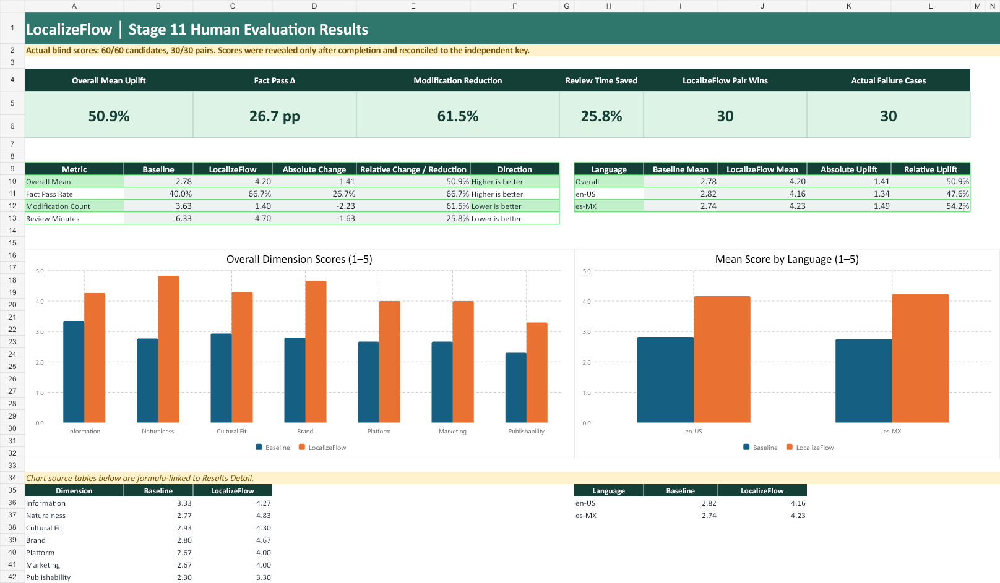
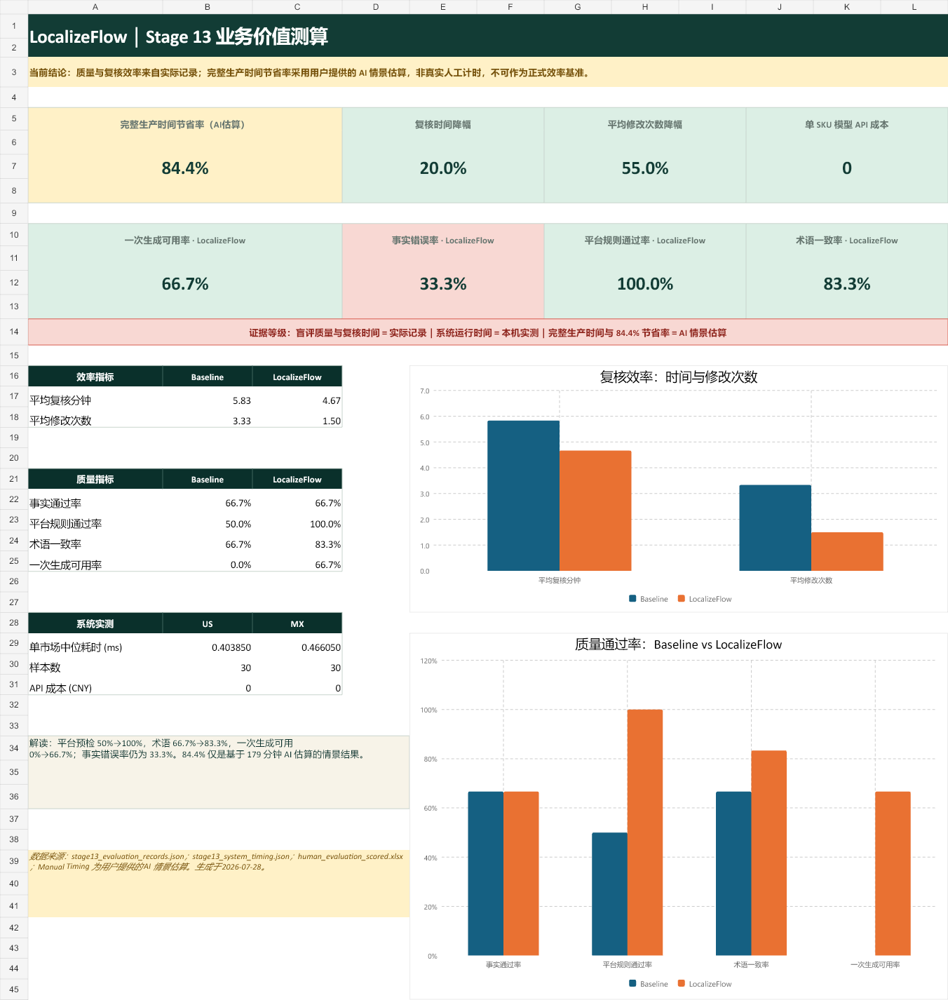

# LocalizeFlow｜跨境商品本地化 Copilot

> 把中文商品资料转化为面向美国英语与墨西哥西班牙语市场的可追溯营销内容，并在导出前完成事实、术语、品牌和平台规则预检。

[](https://github.com/zugzwang-zg/LocalizeFlow/actions/workflows/ci.yml)
[](https://github.com/zugzwang-zg/LocalizeFlow/actions/workflows/codeql.yml)
[](LICENSE)
[](pyproject.toml)

[演示视频](demo/LocalizeFlow_Demo.mp4) · [项目概览 PPT](demo/LocalizeFlow_Project_Overview.pptx) · [Demo 操作说明](docs/streamlit_demo.md) · [评测报告](reports/evaluation_report.md) · [隐私说明](PRIVACY.md) · [预览条款](TERMS.md) · [免责声明](DISCLAIMER.md)

GitHub 仓库：<https://github.com/zugzwang-zg/LocalizeFlow>

在线交互式 Demo：<https://localizeflow-demo-86182.reidmozzie.chatgpt.site>

> 当前在线版本使用冻结的虚拟 SKU 和确定性内容，不调用模型 API，也不接收真实客户数据。它用于体验产品工作流，不是生产环境或真实免费试用。

> **合成内容声明：** 虚拟品牌、虚拟 SKU、价格、产品事实、营销候选和评测材料均为 AI 生成的合成内容；其余代码、文档、测量、图表与演示资产由项目方原创。详见 [`DATA_LICENSE.md`](DATA_LICENSE.md)。



## 项目概览

LocalizeFlow 是一个面向跨境电商内容运营人员的离线可运行原型。它解决的不是“把中文翻译成外语”这一个问题，而是将商品事实、消费者洞察、品牌语气、双语术语和平台规则放进同一条可追溯工作流，使运营人员能看到内容为何这样写、用了哪些事实、存在哪些风险，以及人工修改后是否仍满足放行条件。

| 项目维度 | 当前实现 |
|---|---|
| 品类与样本 | 1 个虚拟护肤品牌、5 个虚拟 SKU |
| 市场与语言 | 美国英语（en-US）、墨西哥西班牙语（es-MX） |
| 内容类型 | 商品 Listing、15 秒短视频脚本、通用社媒广告文案 |
| 事实资产 | 结构化事实库、来源、证据等级、允许/禁止宣称 |
| 语言资产 | 品牌语气指南、英西双语术语表、禁用词与谨慎词 |
| 质量门槛 | 事实核验、品牌/术语/平台规则检查、人工终审 |
| 交互与导出 | Web / Streamlit 五步 Demo、问题定位与确定性修复、版本对比、带人工处置记录的 CSV/JSON 导出 |
| 评测规模 | 30 组 A/B、60 条匿名候选、5 SKU × 2 市场 × 3 内容类型 |

## 业务痛点

跨境内容生产通常同时面对四类约束：

1. **事实风险**：生成式内容容易补全不存在的功效、认证、包装或适用人群。
2. **语言风险**：直译会出现翻译腔，目标市场表达、称谓和语域也可能不自然。
3. **一致性风险**：同一商品在不同语言与内容类型中容易出现术语、语气和卖点漂移。
4. **平台风险**：Listing、短视频和社媒文案有不同结构、长度和禁限要求。

LocalizeFlow 将这些约束前置到生成与复核环节，用可定位的 `fact_id`、`insight_id` 和 `rule_id` 代替“只看一段成品文案”的黑箱式审校。

## 核心方案



系统采用七个单一职责节点：

| 节点 | 作用 | 关键输出 |
|---|---|---|
| N01 Fact Extractor | 加载并校验商品事实 | 带来源与证据等级的事实集 |
| N02 Campaign Planner | 在事实边界内选择洞察与营销角度 | 事实/洞察选择、禁止推断 |
| N03 Localizer | 制定目标市场语言与语气方案 | 术语、限定语、不可变事实 |
| N04 Content Generator | 按内容模板生成结构化候选 | Listing、脚本或社媒 JSON |
| N05 Fact Checker | 逐条核验可验证声明 | 支持状态、风险与事实闸门 |
| N06 Rule Checker | 检查品牌、术语与平台规则 | `rule_id`、建议与规则闸门 |
| N07 Quality Evaluator | 在硬门槛外提供辅助评分 | 多维评分与人工复核提示 |

最终导出条件是：

```text
事实检查通过
AND 平台硬规则通过
AND 高风险错误数为 0
AND 人工终审已批准
```

质量总分不能覆盖事实错误或平台硬规则失败。

## 商品事实库

事实库将产品描述拆成可复用、可验证、可定位的最小单元，每条事实保存 `fact_id`、值、单位、来源、证据等级、适用市场和生成门控。

以 `MV-SERUM-001` 水衡保湿精华为例：

| 事实 | 值 | 使用边界 |
|---|---|---|
| 容量 | 30 mL | 数字和单位不可在本地化时改写 |
| 包装 | 不透明 PP 按压泵瓶 | 未核实的包装材质不得自动补全 |
| 关键配方 | 透明质酸钠、泛醇 | 只能陈述“列于模拟配方” |
| 允许表达 | 帮助肌肤感觉水润、柔软 | 必须保留 `helps` 等限定语 |
| 禁止表达 | 72 小时保湿、修复屏障、临床证明 | 命中后阻断或人工复核 |
| 目标市场 | 美国、墨西哥 | 价格与语言按市场分开处理 |

完整资产位于：

- [`data/products/product_master.xlsx`](data/products/product_master.xlsx)：商品主表；
- [`data/products/product_facts.json`](data/products/product_facts.json)：机器可读事实库；
- [`data/products/packaging_facts.json`](data/products/packaging_facts.json)：字段级包装事实与生成前/生成后硬门禁；
- [`data/products/product_cards/`](data/products/product_cards/)：便于人工阅读的商品卡；
- [`data/products/data_dictionary.md`](data/products/data_dictionary.md)：字段与证据等级说明。

## 品牌、本地化与消费者洞察

项目为虚拟品牌 Mirevane Botanics 建立了品牌人格、推荐句式、禁止表达、英西双语术语和风险词规则。消费者洞察来自 CrossBorder Voice 开发样本的人工通读，仅用于选择内容角度，不用于推断市场规模，也不能替代商品事实。

洞察进入生成前必须经过三种映射状态：

- `eligible`：有商品事实支持，可作为内容角度；
- `strategy_only`：只影响语言或结构，不能变成产品宣称；
- `blocked`：缺少事实支持，不得进入生成。

例如，英语样本显示消费者关注柔软、舒适的可感知肤感；该方向有精华的允许宣称支持，可谨慎表述为 “helps skin feel soft”。“不黏腻、快速吸收”虽然在评论中出现，但当前产品事实没有对应测试，因此被标记为 `blocked`。

相关资产：

- [`data/brand/brand_voice_guide.md`](data/brand/brand_voice_guide.md)
- [`data/brand/terminology.xlsx`](data/brand/terminology.xlsx)
- [`data/brand/prohibited_terms.csv`](data/brand/prohibited_terms.csv)
- [`data/insights/consumer_insights.json`](data/insights/consumer_insights.json)
- [`data/insights/insight_fact_mapping.xlsx`](data/insights/insight_fact_mapping.xlsx)

## 平台与规则预检

商品 Listing 使用 Google Merchant Center 规则，短视频脚本使用 TikTok Ads 规则；通用社媒模板被明确标注为项目内部模板，不冒充任何真实平台规范。规则库区分官方硬规则、官方最佳实践、品牌规则和项目内部规则，并保存来源链接与核验日期。

检查范围包括字符限制、结构字段、禁用宣称、品牌语气、目标市场语言与货币、首选术语、CTA 和 AI 内容标识。自动预检只用于提前发现问题，不代表平台批准，也不替代法务、品牌方或目标语言专业人员的最终审核。

## Demo：从商品到可导出版本

Web 与 Streamlit Demo 将完整链路压缩成五步，公开 Web Demo 提供推荐的约 3 分钟体验路径：

1. **商品资料**：选择 SKU，查看结构化事实、允许和禁止表达；
2. **营销任务**：选择市场、平台、内容类型、目标人群和营销目标；
3. **生成结果**：查看三类内容及每条事实声明的来源；
4. **质量检查**：定位命中文本、一键执行确定性修复、自动复检，并记录警告保留原因；
5. **版本与导出**：比较 Baseline 与增强版，人工修订、复检、确认并导出处理动作与时间戳。





当前 Demo 采用冻结评测内容与确定性模板，不调用模型 API，也不连接真实发布平台；因此可在没有密钥的环境中稳定复现端到端流程。

### Closed Beta 本地候选（默认关闭）

仓库包含一条尚未对外开放的 Closed Beta 候选链路：CSV/XLSX/JSON 安全导入、缺失/冲突/低证据提示、人工事实确认、OpenAI-compatible 中转站模型调用、JSON Schema 校验、事实与包装复检、人工终审和审计包导出。模型开关默认关闭；未完成身份、项目隔离、删除、模型提供方披露与成本保护验证前，不得用托管环境接收真实资料。

- [`templates/LocalizeFlow_Beta_SKU_Import_Template.xlsx`](templates/LocalizeFlow_Beta_SKU_Import_Template.xlsx)：受控 SKU 导入模板；
- [`templates/LocalizeFlow_Closed_Beta_Evaluation.xlsx`](templates/LocalizeFlow_Closed_Beta_Evaluation.xlsx)：真实任务、双评审和采用意愿记录；
- [`docs/beta/closed_beta_protocol.md`](docs/beta/closed_beta_protocol.md)：范围、招募、退出与停止条件；
- [`docs/beta/model_gateway_operations.md`](docs/beta/model_gateway_operations.md)：模型网关、数据最小化、成本与审计要求。

## 内容案例与事实检查

代表性 US Listing 使用 `fact_id` 引用容量、配方、肤感和使用方法。事实核验模块输出：

- `supported`：被事实库直接支持；
- `partially_supported`：需要限制范围或补充限定语；
- `unsupported`：无事实依据；
- `contradicted`：与已知事实矛盾；
- `subjective`：主观表达，不能作为事实证明。

高风险 `unsupported` 或任何 `contradicted` 会阻断导出。包装已拆分为容量、容器、材质、泵、旋盖、内盖、透明度和套装组件等字段；缺失字段一律为 `unknown`，不得推断。门禁在生成前、生成后和人工编辑后运行。30/30 个冻结增强输出通过当前包装门禁，错误材质、错误容器、未知字段声明和混用 SKU 回归用例均被阻断，详见 [`reports/packaging_gate_validation.md`](reports/packaging_gate_validation.md)。

## A/B 评测

盲评覆盖 5 个 SKU、2 个市场和 3 种内容类型，共 30 组 A/B、60 条匿名候选。揭盲前后使用独立密钥与 SHA-256 核验候选未被替换。

| 指标 | Baseline | LocalizeFlow | 变化 |
|---|---:|---:|---:|
| 七维总体均分 | 2.78 | 4.20 | +50.9% |
| 事实通过率 | 40.0% | 66.7% | +26.7 个百分点 |
| 平均修改次数 | 3.63 | 1.40 | -61.5% |
| 平均审核时间 | 6.33 分钟 | 4.70 分钟 | -25.8% |
| 阈值失败候选 | 20 | 10 | -50.0% |
| A/B 配对胜出 | 0/30 | 30/30 | LocalizeFlow 30/30 |



这些结果来自单评审者评分记录，适用于当前项目样本，不代表统计显著性检验或真实平台批准。完整结果见 [`reports/evaluation_report.md`](reports/evaluation_report.md)。

## 业务价值与证据等级

对于代表性 SKU `MV-SERUM-001`，实际盲评与本地规则记录显示：

| 指标 | Baseline | LocalizeFlow | 证据性质 |
|---|---:|---:|---|
| 平均复核时间 | 5.83 分钟 | 4.67 分钟（-20.0%） | 实际盲评记录 |
| 平均修改次数 | 3.33 | 1.50（-55.0%） | 实际盲评记录 |
| 一次生成可用率 | 0.0% | 66.7% | 实际盲评 + 本地规则 |
| 平台规则预检通过率 | 50.0% | 100.0% | 本地规则检查 |
| 术语一致率 | 66.7% | 83.3% | 本地术语规则 |
| 事实错误率 | 33.3% | 33.3% | 实际盲评记录，未改善 |

另有一项**情景分析**：六项纯人工任务的 AI 估算合计为 179 分钟，与 LocalizeFlow 的实际复核/系统记录组合后得到 84.4% 的情景节省率。该值不是专业人士现场计时，不能表述为“已实测节省 84.4%”。



详细口径见 [`reports/business_value_report.md`](reports/business_value_report.md) 与 [`data/measurements/business_value_measurements_scenario.xlsx`](data/measurements/business_value_measurements_scenario.xlsx)。

## 局限与失败案例

- 仅测试 1 个虚拟品牌、5 个虚拟 SKU，不能直接外推到其他品类；
- 盲评只有一位评审者，无法计算评审者间一致性；
- 洞察样本缺少评论者国家字段，只作为语言代理，不代表美国或墨西哥总体趋势；
- 字段级包装门禁已覆盖当前 5 个 SKU，但词典式文本识别仍不是通用语义验证器，新品类和新语言必须补充字段与回归样本；
- 当前 Demo 为离线确定性原型，API 成本为 0 不代表未来在线模型成本；
- 规则预检不代表 Google、TikTok 或其他平台实际批准；
- 任何高风险功效、医疗、认证或法律判断仍需专业人员终审。

下一步应优先增加多评审者复核、目标国家本地样本，以及在配置 API 后记录真实模型响应、延迟、成本与结构化输出成功率。

## 本地运行

### Python / Streamlit Demo

支持 Python 3.11–3.13。在项目根目录执行：

```powershell
python -m venv .venv
.\.venv\Scripts\python.exe -m pip install uv==0.12.4
.\.venv\Scripts\uv.exe sync --locked --extra dev
.\.venv\Scripts\uv.exe run streamlit run app\main.py
```

macOS 或 Linux：

```bash
python3 -m venv .venv
./.venv/bin/python -m pip install uv==0.12.4
./.venv/bin/uv sync --locked --extra dev
./.venv/bin/uv run streamlit run app/main.py
```

浏览器打开 `http://localhost:8501`。推荐路径见 [`docs/streamlit_demo.md`](docs/streamlit_demo.md)。

运行测试：

```powershell
.\.venv\Scripts\uv.exe run pytest -q
.\.venv\Scripts\uv.exe run ruff check .
.\.venv\Scripts\uv.exe run mypy
```

### 浏览器原生 Web Demo

支持 Node.js 22.13 或更高版本与 pnpm 11：

```bash
cd web
pnpm install --frozen-lockfile
pnpm dev
```

Web 验证命令：

```bash
pnpm lint
pnpm test
pnpm build
pnpm security:audit
```

Python Demo 与 Web Demo 使用同一组冻结的虚拟事实和评测内容。Python 版本用于展示完整服务与检查逻辑；Web 版本用于无需 API 的公开交互体验。

## API 配置

当前版本无需 API 即可运行。若后续接入在线模型：

1. 复制 `.env.example` 为 `.env`；
2. 只在本地 `.env` 中填写真实密钥；
3. 不要将密钥写入代码、文档、截图或提交记录；
4. 补充模型名称、提示词版本、调用次数、延迟、费用与失败日志。

## 项目结构

```text
localizeflow/
├─ app/           # Streamlit 交互入口
├─ assets/        # 截图与评测图表
├─ data/          # 商品、品牌、洞察、规则、评测与测量数据
├─ demo/          # 项目概览 PPT、PDF 与演示视频
├─ docs/          # 工作流、演示和计时说明
├─ prompts/       # 提示词、Schema 与离线验证
├─ reports/       # 事实、规则、A/B 评测和业务价值报告
├─ src/           # 事实检查、规则检查与 Demo 服务
└─ tests/         # 自动化测试
```

## 复现与验证

项目保留事实来源、规则命中、人工修订、版本追踪和评测记录。运行自动化测试可验证核心事实检查、规则检查、状态门控与导出逻辑；演示包提供可编辑概览、PDF 预览和离线视频。

## 贡献、安全与路线图

- 贡献流程：[`CONTRIBUTING.md`](CONTRIBUTING.md)
- 安全漏洞报告：[`SECURITY.md`](SECURITY.md)
- 产品路线图：[`ROADMAP.md`](ROADMAP.md)
- 版本变更：[`CHANGELOG.md`](CHANGELOG.md)
- 数据与评测材料：[`DATA_LICENSE.md`](DATA_LICENSE.md)
- 第三方声明：[`THIRD_PARTY_NOTICES.md`](THIRD_PARTY_NOTICES.md)

请勿在 Issue、PR、截图、测试夹具或日志中提交密钥、真实客户数据或未公开的商品资料。

## 开源许可证

LocalizeFlow 采用 [Apache License 2.0](LICENSE)。虚拟品牌、商品、价格、营销候选和评测材料为 AI 生成的合成内容，仅用于演示与研究，不代表真实品牌、平台批准、法律意见或医疗证据。
