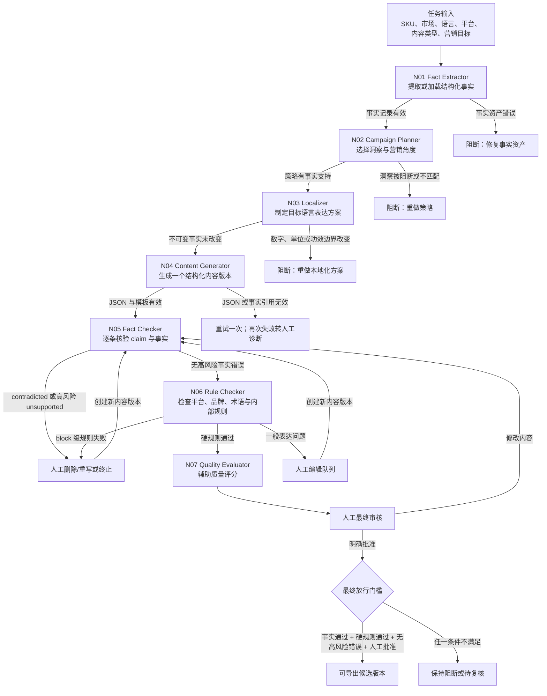

# LocalizeFlow AI 工作节点设计

> 工作流 ID：`LF-AI-WORKFLOW-V1`  
> 版本：`1.0.0`  
> 日期：2026-07-28  
> 状态：设计已完成

## 1. 设计目标

LocalizeFlow 将“策略选择、语言本地化、内容生成、事实检查、规则检查和质量评分”拆成可独立检查的节点。每个节点只承担一个明确任务，所有输入、输出、规则版本、模型参数、失败原因和人工修改均保存为 JSON。

这套设计解决三个追踪问题：

1. 某条文案使用了哪些 `fact_id`、`insight_id` 和 `rule_id`；
2. 内容在哪个节点首次产生、被判定有问题或被人工修改；
3. 使用同一输入、资产版本、提示词版本和参数时，如何复现一次运行。

## 2. 完整工作流



质量总分不能覆盖事实错误或平台硬规则失败；所有人工修改都必须先生成新版本，再从 N05 重新执行事实检查和 N06 规则检查。

## 3. 七个节点的职责边界

| 节点 | 唯一任务 | 主要输入 | 主要输出 | 明确不负责 |
|---|---|---|---|---|
| N01 Fact Extractor | 把中文商品资料规范化为事实记录，或加载并验证既有事实 | SKU、中文资料/事实库、目标市场 | 带 `fact_id`、证据等级、来源和生成门控的事实集 | 营销策略、翻译、成品文案 |
| N02 Campaign Planner | 在事实支持范围内选择洞察并制定内容策略 | 商品事实、消费者洞察、营销目标 | 洞察选择、事实选择、信息优先级、禁止推断 | 最终文案、事实创造 |
| N03 Localizer | 制定目标语言表达方案 | 策略、市场、术语、品牌语气 | 术语决定、语气决定、限定语、不可变值 | 完整平台成品、平台审核 |
| N04 Content Generator | 按指定模板生成一个内容版本 | 本地化方案、平台规则、内容模板 | Listing、脚本或社媒文案 JSON | 最终事实/规则判定 |
| N05 Fact Checker | 逐条判断事实支持状态 | 生成内容、事实快照 | `supported / unsupported / contradicted` 等结果与事实门槛 | 改文案、语言评分 |
| N06 Rule Checker | 检查平台、品牌、术语和内部规则 | 内容、事实检查、规则资产 | 按 `rule_id` 定位的违规、建议和规则门槛 | 事实真伪重判、直接修改 |
| N07 Quality Evaluator | 在硬门槛之外给出辅助质量评分 | 内容、事实结果、规则结果、评分量表 | 六维评分、理由、限制、流程状态 | 覆盖阻断、替代人工终审 |

## 4. 数据传递格式

每个节点输出都包在统一 envelope 中：

```json
{
  "schema_version": "1.0",
  "workflow_id": "LF-AI-WORKFLOW-V1",
  "workflow_version": "1.0.0",
  "run_id": "run_20260728_0001",
  "trace_id": "trace_0001",
  "node_run_id": "run_20260728_0001.N04.a01",
  "node_id": "N04_CONTENT_GENERATOR",
  "attempt": 1,
  "status": "success",
  "started_at": "ISO-8601 timestamp",
  "completed_at": "ISO-8601 timestamp",
  "input_refs": [],
  "asset_versions": {},
  "output": {},
  "errors": [],
  "warnings": [],
  "execution_metadata": {}
}
```

`input_refs` 不只保存文件路径，还保存版本与 SHA-256。模型节点的 `execution_metadata` 至少记录模型、提示词版本、温度、可复现种子或限制说明、响应 Schema、耗时与费用；确定性检查节点记录程序或检查器版本。

## 5. 中间结果保存

### 5.1 目录约定

```text
runs/
└── {run_id}/
    ├── manifest.json
    ├── 01_fact_extractor/
    │   └── attempt_01/output.json
    ├── 02_campaign_planner/
    │   └── attempt_01/output.json
    ├── 03_localizer/
    │   └── attempt_01/output.json
    ├── 04_content_generator/
    │   └── attempt_01/output.json
    ├── 05_fact_checker/
    │   └── attempt_01/output.json
    ├── 06_rule_checker/
    │   └── attempt_01/output.json
    ├── 07_quality_evaluator/
    │   └── attempt_01/output.json
    └── human_edits/
        └── {version_id}.json
```

运行目录由执行模块在实际运行时创建；本文件定义接口和保存约定。

### 5.2 文件不可覆盖

- 重试使用新的 `attempt`；
- 人工修改使用新的 `version_id`；
- 每个版本保留 `parent_version_id`、修改人、时间、原因、修改位置和内容摘要；
- 旧输出、原始模型响应和失败记录不可覆盖；
- 修改后的内容必须重新运行 N05 和 N06。

## 6. ID 与版本追踪

| 标识 | 追踪范围 | 示例 |
|---|---|---|
| `run_id` | 一次完整任务 | `run_20260728_0001` |
| `trace_id` | 跨节点、重试和人工编辑的内容链 | `trace_0001` |
| `node_run_id` | 一次节点执行 | `run_20260728_0001.N04.a01` |
| `content_id` | 同一内容对象 | `content_MV-SERUM-001_US_listing` |
| `version_id` | 内容的具体版本 | `content_..._v01` |
| `claim_id` | 内容中的一条可核验陈述 | `claim_v01_003` |
| `fact_id` | 商品事实 | `MV-SERUM-001-F003` |
| `insight_id` | 消费者洞察 | `IN-US-001` |
| `rule_id` | 平台/品牌/内部规则 | `GMC-H-002` |

借助这些标识，可以从违规结果追到具体文字位置、内容版本、生成节点、上游策略、洞察和事实来源。

## 7. 事实与洞察门控

### 7.1 商品事实

| 证据等级 | 工作流处理 |
|---|---|
| A | 可直接使用，但仍需准确复述 |
| B | 只能使用谨慎、带限定语的表达 |
| C | 不得直接输出，可作为待验证方向 |
| D | 阻断生成 |

N01 保留既有事实库的门控，N02–N04 不得降低等级，N05 对数字、单位、价格、成分和用法优先进行精确比对。

### 7.2 消费者洞察

| `mapping_status` | 允许用途 |
|---|---|
| `eligible` | 可选择为内容角度，但具体卖点仍必须由 `linked_fact_ids` 支持 |
| `strategy_only` | 只能影响语言或结构策略 |
| `blocked` | 不得进入策略和生成 |

代表性评论只用于解释洞察来源，不得变成品牌商品评价、用户证言或商品事实。

## 8. 异常处理

### 8.1 阻断类

以下情况立即阻断，不进入依靠高分放行的路径：

- 事实与事实库矛盾；
- 高风险宣称无事实支持；
- 使用 C/D 级事实；
- 使用 `blocked` 洞察；
- 本地化改变数字、单位、价格、成分、用法或功效边界；
- 平台硬规则失败；
- 品牌禁止宣称命中；
- 内容或人工修改缺少版本记录；
- 未完成人工最终确认。

### 8.2 人工复核类

以下情况进入人工队列，但自动评分不能直接放行：

- B 级事实的限定语是否充分；
- 语言自然度、称谓、语域或文化适配问题；
- 平台最佳实践未满足；
- 语义检测结果不确定；
- `insufficient_information`；
- 目标语言专业人员需要确认的表达。

### 8.3 技术重试

API 超时、限流、单次非法 JSON 或单次 Schema 错误最多自动重试一次。每次重试保存新 `attempt`，不得删除失败输出。事实矛盾、规则失败和版本不匹配不属于自动重试问题。

## 9. 最终放行条件

```text
fact_check.export_gate == "pass"
AND rule_check.export_gate == "pass"
AND high_risk_error_count == 0
AND human_final_review.status == "approved"
```

质量评分仅用于排序、诊断和改进，不能替代上述门槛。即使所有自动检查通过，系统状态仍应为“等待人工最终审核”，而不是“平台已批准”。

## 10. 可复现要求

复现一次运行至少需要：

- `run_id`、`trace_id` 和完整节点输出；
- 输入商品、市场、语言、平台、内容类型与营销目标；
- 事实、洞察、品牌、术语和平台规则的版本及 SHA-256；
- 模型名称、提示词版本、参数、响应 Schema；
- 程序或检查器版本；
- 所有自动重试和人工修改版本；
- 最终人工审核记录。

示例运行清单位于 `data/workflow/run_manifest.example.json`，只展示结构，不代表已执行生成或获得平台批准。

## 11. 设计核对清单

- [x] 七个节点均有单一职责和明确“不负责”事项；
- [x] 每个节点均定义必需输入、结构化输出和成功条件；
- [x] 中间结果均按节点和 attempt 保存为 JSON；
- [x] 事实错误、平台硬规则与一般表达问题采用不同处理路径；
- [x] 高风险事实错误直接阻断导出；
- [x] 人工修改生成新版本并强制重新检查；
- [x] 可通过 ID、版本和内容位置定位修改或拒绝发生在哪一步；
- [x] 自动评分不能覆盖硬门槛；
- [x] 平台与人工最终审核不可被系统替代。
