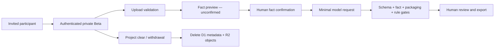

# Closed Beta data flow and minimization

## Data classes

| Data | Purpose | Default storage | Sent to model | Log policy |
|---|---|---|---|---|
| Account ID and allowlist | authentication and authorization | D1 | no | identifier and result |
| Original upload | parse and confirm facts | R2, private project prefix | no | filename hash, size, result |
| Confirmed facts | generation constraints and audit | D1 | minimum necessary subset | fact IDs and versions only |
| Prompt and output body | produce candidate content | transient by default | yes | no body by default |
| Quality/gate result | block unsafe export | D1 | no | rule/fact IDs and status |
| Export file | participant download | transient or R2 by explicit choice | no | export ID and result |

## Deployment gate

The repository may implement and test this flow with synthetic fixtures. Real data must not be accepted until authentication, allowlist enforcement, D1/R2 ownership checks, provider disclosure, deletion, cost protection, and incident handling are all verified in the actual hosted environment.
